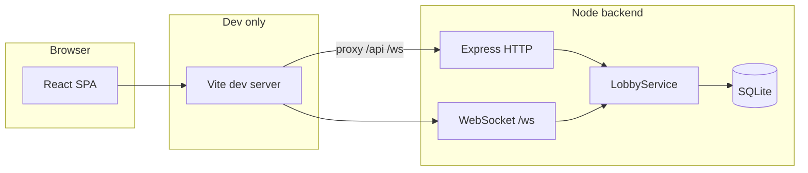

# Documentation

Technical documentation for the Taboo full-stack app. For a **short overview and quick start**, see the root [README.md](../README.md).

## Suggested reading order

**First time in the repo**

1. [Getting started](getting-started.md) — run the app locally  
2. [Architecture](architecture.md) — how pieces fit together  
3. [Game logic](game-logic.md) — rules as implemented in code  
4. [Realtime system](realtime-system.md) — WebSocket flow  

**Implementing a feature**

1. [Backend](backend.md) or [Frontend](frontend.md) — where code lives  
2. [API reference](api-reference.md) — HTTP and WS contracts  
3. [Contributing](contributing.md) — tests and conventions  

**Shipping or debugging**

1. [Deployment](deployment.md)  
2. [Troubleshooting](troubleshooting.md)  
3. [Database](database.md) — persistence and tables  

## System overview

In **production**, the static frontend usually talks to the API origin directly (`VITE_API_BASE_URL`); WebSocket URL is derived from that base.

## Doc index

| File | What you’ll find |
|------|-------------------|
| [getting-started.md](getting-started.md) | Prerequisites, `./start.sh`, env vars, verify install |
| [architecture.md](architecture.md) | Authority model, modules, diagrams |
| [game-logic.md](game-logic.md) | Phases, roles, scoring, deck, guesses |
| [realtime-system.md](realtime-system.md) | Subscribe, broadcasts, resume, ticker |
| [backend.md](backend.md) | Folder structure, services, middleware |
| [frontend.md](frontend.md) | Routes, `LobbyContext`, pages |
| [database.md](database.md) | Tables, SQLite file, WAL |
| [api-reference.md](api-reference.md) | Endpoints and message types |
| [deployment.md](deployment.md) | Production env, CORS, WSS |
| [troubleshooting.md](troubleshooting.md) | Port conflicts, CORS, WS, DB |
| [contributing.md](contributing.md) | Tests, adding actions, style |
| [glossary.md](glossary.md) | Terms and status values |
