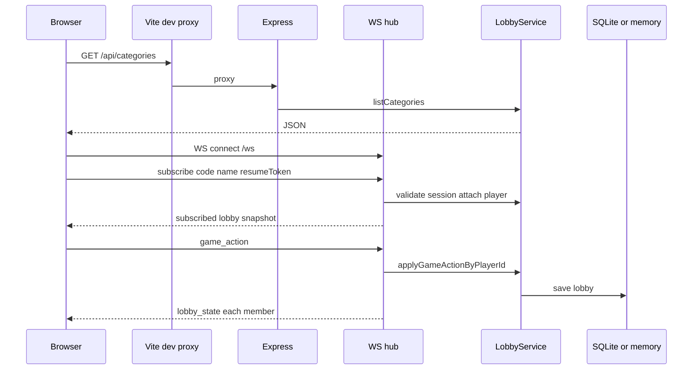

# Architecture

## Five-minute summary

1. **The server owns the game.** All mutations go through HTTP (bootstrap) or WebSocket (`game_action`). Clients render **snapshots** they receive; they do not advance turns or scores locally.
2. **Broadcasts are personalized.** Each connected player gets a `lobby_state` payload built with `toLobbySnapshot(lobby, { viewerPlayerId })` so roles (e.g. who sees the card) stay correct.
3. **Time advances on the server.** A **1-second ticker** in the WebSocket hub calls `advanceExpiredGames` so turn timeouts and between-phase delays resolve even if nobody clicks.

**Interview tip:** Saying *“authoritative server + snapshot sync”* is clearer than *“we use WebSockets”* alone—it shows you care about cheating, consistency, and reconnects.

## High-level diagram



## Repository layout

```text
taboo/
├── backend/           # Node API + WebSocket + game rules
│   ├── src/
│   │   ├── app.js           # Express app factory
│   │   ├── server.js        # HTTP server, attach WS, listen
│   │   ├── config/          # env parsing
│   │   ├── controllers/     # HTTP handlers
│   │   ├── routes/          # Route tables
│   │   ├── services/        # lobbyService, datasetService
│   │   ├── repositories/    # SQLite + in-memory stores
│   │   ├── realtime/        # WebSocket hub
│   │   ├── middleware/
│   │   ├── database/        # SQLite bootstrap + migrations SQL
│   │   └── utils/
│   ├── tests/
│   └── index.js
├── frontend/          # React SPA
│   ├── src/
│   │   ├── pages/
│   │   ├── context/         # LobbyProvider + WebSocket
│   │   ├── api/             # fetch helpers
│   │   ├── components/
│   │   └── router/
│   └── vite.config.js       # dev proxy /api and /ws
├── Dataset/           # taboo.json card data
├── docs/
├── start.sh
└── README.md
```

## Authority and boundaries

| Concern | Owner |
|---------|--------|
| Turn order, timers, scores, deck, reviews | `LobbyService` |
| HTTP REST surface | Express routes + controllers |
| Realtime transport | `lobbyRealtimeHub` (validates session, forwards actions) |
| Card content | `DatasetService` + `Dataset/taboo.json` |
| Persistence | Repositories (SQLite or in-memory) |

The **frontend** never computes final guess correctness for scoring; it may mirror UX hints, but the server’s `applyGuessSubmission` is the source of truth.

## Snapshot model

Instead of streaming dozens of micro-events, the server sends a **full lobby snapshot** (with a `reason` string for debugging) after each change. Benefits:

- Simple client: set state from one object.
- Consistent role-based fields (`permissions`, `currentCard` visibility).
- Easier to add fields without versioning many event types.

Tradeoff: payloads grow with lobby size; history is trimmed in snapshots during play (full history when the game is finished).

## Timers and phases

Game phases (`waiting_to_start_turn`, `turn_in_progress`, `between_turns`, `between_rounds`, `finished`) are advanced by:

1. **Explicit actions** (e.g. `start_turn`, correct guess drawing a new card).
2. **Ticker** — `lobbyRealtimeHub` runs `advanceExpiredGames` every second so `turnEndsAt` / `phaseEndsAt` expire reliably.

## Scaling note (honest)

Today, **lobbies and timers live in one Node process**. Horizontal scaling would need shared state (Redis, etc.) or sticky sessions plus a single writer—out of scope for this repo but worth mentioning in interviews.

## See also

- [Game logic](game-logic.md)  
- [Realtime system](realtime-system.md)  
- [Backend](backend.md)  
